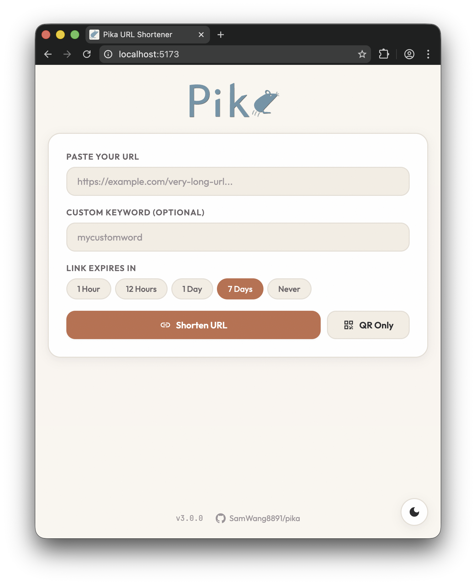
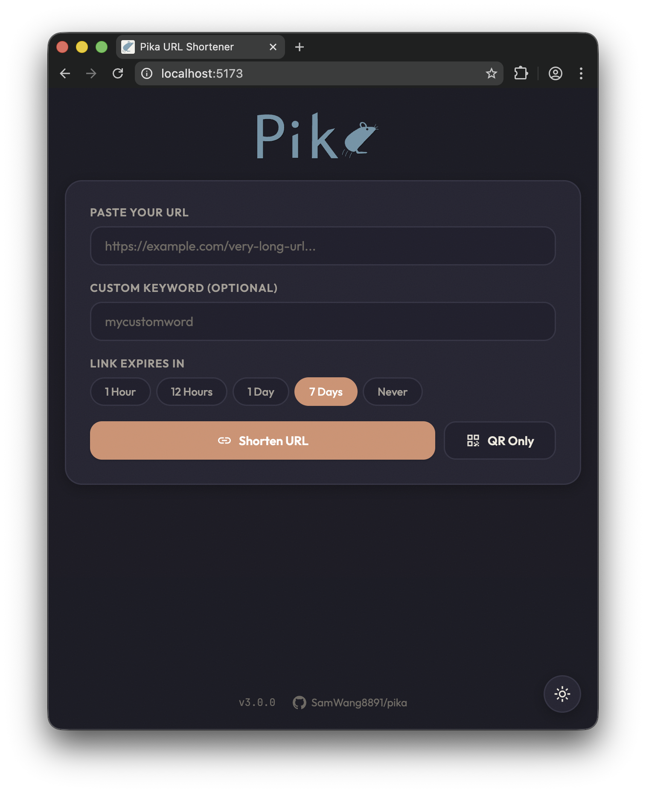
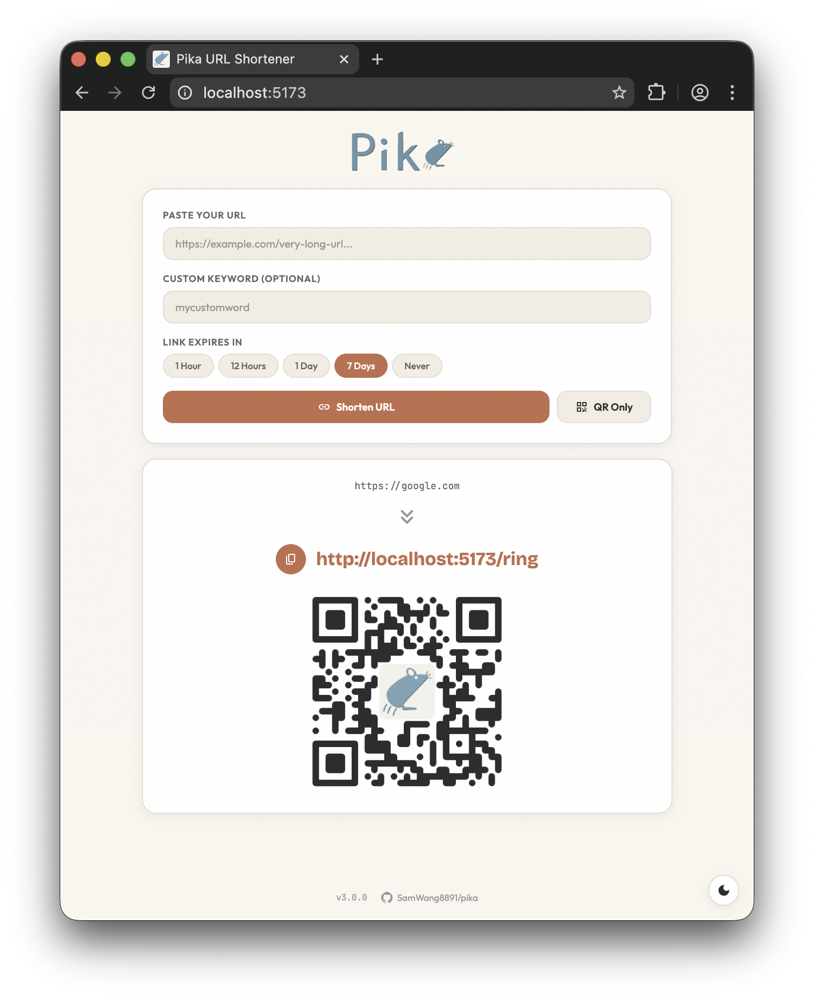
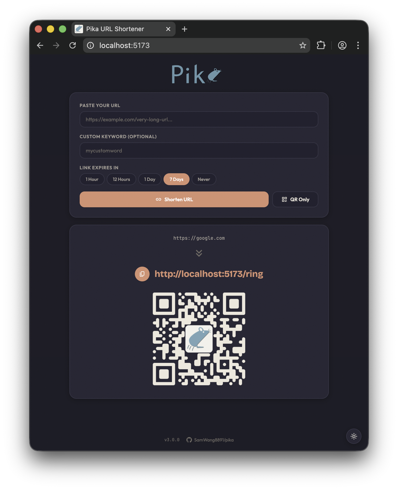
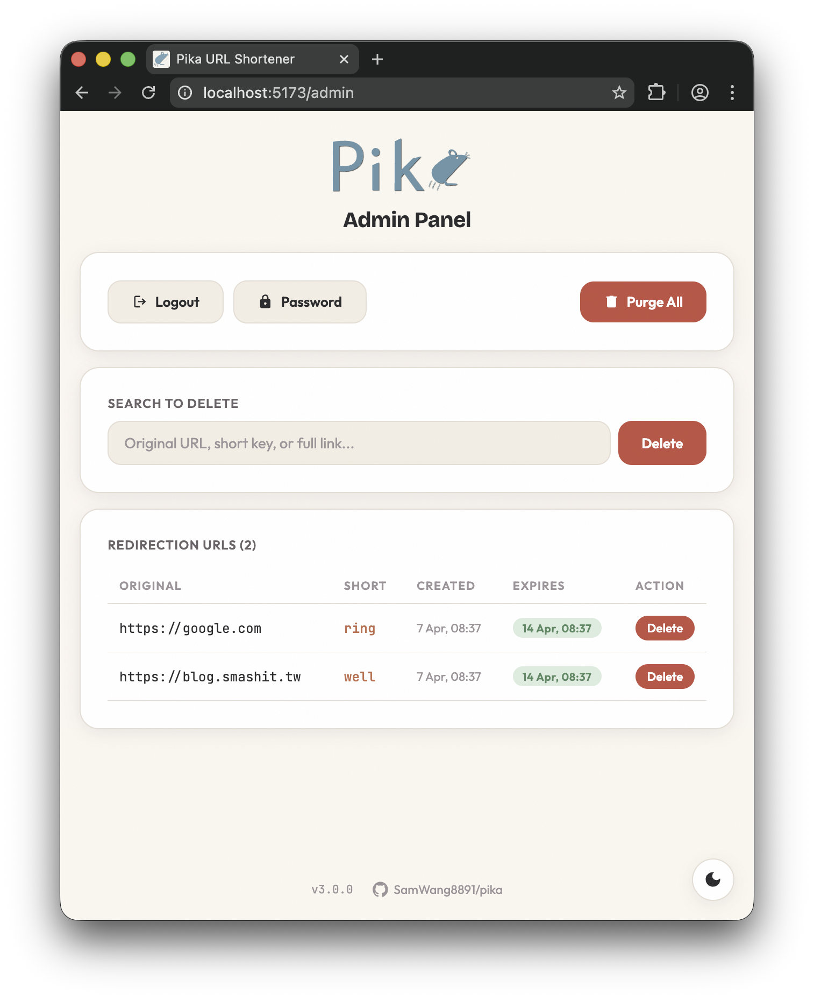
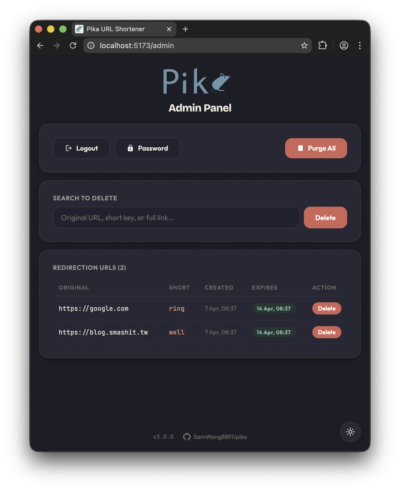

<div align="center">


# Pika


A very simple URL shortener that converts URLs into easy-to-remember English words for improved usability.

[台灣繁體中文 請按這](README.zh-tw.md)

</div>

---

> [!IMPORTANT]
> **v5 runs entirely on Cloudflare Workers + D1.** One Hono worker serves the React SPA, the
> `/api/v4` API, and the short-link redirects; D1 is the database. The self-hosted
> FastAPI + nginx + Docker stack ended with
> [v4.0.0](https://github.com/SamWang8891/pika/releases), which remains available on the
> release page.

---

## Table of Contents 📖

- [Why "Pika" ❓](#why-"pika"-?)
- [Features ✨](#features-)
- [Screenshots 📸](#screenshots-)
- [Usage 🚀](#usage-)
    - [Deploying ⚙️](#deploying-)
    - [Redirect Behavior 🔀](#redirect-behavior-)
    - [Random Strings 🎲](#random-strings-)
    - [Admin Panel 🛡](#admin-panel-)
    - [Resetting the Admin Password 🔑](#resetting-the-admin-password-)
    - [Rate Limiting 🕒](#rate-limiting-)
    - [Customizing the Dictionary 📚](#customizing-the-dictionary-)
- [Development 🛠](#development-)
    - [File Structure 🗄](#file-structure-)
    - [Prerequisites ✅](#prerequisites-)
    - [Running Locally 🚧](#running-locally-)
    - [API Access for Scripts 🤖](#api-access-for-scripts-)
- [Special Thanks 🙏](#special-thanks-)
- [Notes 📝](#notes-)
    - [External Sources Used 💿](#external-sources-used-)
    - [Known Bugs 🐛](#known-bugs-)
    - [Hidden Features 🙈](#hidden-features-)
- [Issues / Bugs? 🙋‍♀️](#issues--bugs-)

---

## Why "Pika" ❓

Pikas are known for being tiny, moves fast and jumps high. So I named this project Pika to emphasise that it is tiny and
runs fast.

## Features ✨

Found randomly generated URLs too hard to remember? This project offers another solution:

- Generates user-friendly shortened URLs like [https://example.com/apple](https://google.com).
- Shortened URLs can also be customized.
- Prefer opaque links? A second button shortens with a short random string (4+ lowercase characters) instead
  of a dictionary word.
- Resolved server-side as an HTTP `307`, so links work in browsers *and* in command-line tools such as
  `curl` or PowerShell's `irm`.
- Apple mobile web app capability—add it to your home screen for a full-screen app-like experience.
- Supports light and dark modes for a better user experience.
- Fully customizable dictionary for randomized URL shortening.
- Runs on Cloudflare's free tier — no server to maintain.

---

## Screenshots 📸

<div align="center">

<table>
    <thead>
        <tr>
            <th style="text-align: center;">Light Mode ⚪</th>
            <th style="text-align: center;">Dark Mode ⚫</th>
        </tr>
    </thead>
    <tbody>
        <tr>
            <td align="center">
                <br/>
                🏠⚪ Main page light mode
            </td>
            <td align="center">
                <br/>
                🏠⚫ Main page dark mode
            </td>
        </tr>
        <tr>
            <td align="center">
                <br/>
                🏠⚪🔗 Main page light mode with QR Code
            </td>
            <td align="center">
                <br/>
                🏠⚫🔗 Main page dark mode with QR Code
            </td>
        </tr>
        <tr>
            <td align="center">
                <br/>
                🛡⚪ Admin page light mode
            </td>
            <td align="center">
                <br/>
                🛡⚫ Admin page dark mode
            </td>
        </tr>
    </tbody>
</table>

</div>

---

## Usage 🚀

### Deploying ⚙️

You need a Cloudflare account (the free tier works) and [pnpm](https://pnpm.io).

1. Install dependencies and log in to Cloudflare:
   ```bash
   pnpm install
   pnpm wrangler login
   ```
2. Create the D1 database and paste the `database_id` it prints into `wrangler.jsonc`:
   ```bash
   pnpm wrangler d1 create pika
   ```
3. Create the schema and seed the dictionary and admin account:
   ```bash
   pnpm db:migrate
   ```
4. Set the secrets:
   ```bash
   pnpm wrangler secret put SECRET_KEY    # e.g. openssl rand -hex 64
   pnpm wrangler secret put BEARER_TOKEN  # e.g. openssl rand -hex 16
   ```
5. Deploy (`run` matters — plain `pnpm deploy` is a pnpm built-in, not this script):
   ```bash
   pnpm run deploy
   ```
6. You're all set! Add a [custom domain](https://developers.cloudflare.com/workers/configuration/routing/custom-domains/)
   to the worker if you want your links on your own hostname.

### Redirect Behavior 🔀

Shortened links are resolved by the worker and answered with an HTTP `307 Temporary Redirect`. No page is
rendered in between, so a link works anywhere an HTTP client does:

```bash
curl -L https://example.com/apple
```

```powershell
irm https://example.com/apple | iex
```

`307` rather than `301` is deliberate. When a link expires, its keyword is returned to the dictionary and may
later be issued to a different URL — a `301` would be cached permanently by browsers and keep sending
visitors to the old destination.

> ⚠️ Piping a shortened link into a shell runs whatever that record currently points at, and anyone with
> admin access can repoint it. Only do this with links you control.

### Random Strings 🎲

Don't want a dictionary word? **Shorten with random string** on the home page asks the server for an opaque
alphanumeric key instead. How it's allocated, server-side:

- Keys are **all lowercase** (`a-z0-9`) and start at **4 characters** (~1.7M combinations) — no case to
  guess when typing one out.
- A key is claimed by inserting it directly — the database's `UNIQUE` constraint is the collision check, so
  two concurrent requests can never get the same key.
- After **10 collisions in a row** the length grows by one character and it tries again.
- Random-string mode always mints a fresh key: shortening the same URL twice gives two different links
  (unlike dictionary mode, which returns the existing one).

The same thing over the API — `random_string: true` on `create_record`:

```bash
curl -X POST https://example.com/api/v4/create_record \
  -H 'content-type: application/json' \
  -d '{"url":"https://example.com/very-long-url","random_string":true,"expires_in":"7d"}'
```

### Admin Panel 🛡

Access the admin panel at: `https://example.com/admin`

Default admin account:

```plaintext
username: admin
password: password
```

Remember to change the password after the first login.

### Resetting the Admin Password 🔑

Forgot the password? Reset it back to `password` (the `\$` escapes matter — the hash contains `$`):

```bash
pnpm wrangler d1 execute pika --remote --command "UPDATE login SET password='pbkdf2\$100000\$I/3PIRTUbXeLEOYhShbQrw==\$gT/GEuB1CrPa7URCcXVcOa8Pis48gWlA5yeq94SoLjQ=' WHERE username='admin'"
```

### Rate Limiting 🕒

The worker itself does not rate-limit (the old nginx 10 r/s rule is gone). If you need one, add a
[Cloudflare WAF rate limiting rule](https://developers.cloudflare.com/waf/rate-limiting-rules/) on your zone —
it runs in front of the worker and is configurable per path.

### Customizing the Dictionary 📚

Random keywords come from the word pool in `migrations/0002_seed_dictionary.sql`. Edit it **before** running
`pnpm db:migrate`. Words must be alphanumeric (`A-Za-z0-9`).

**Reserved Words:**
Avoid using the following reserved words:
`login`, `admin`, `logout`, `api`, `index`, `index.html`, `change_pass`. They can never be claimed as keywords.

---

## Development 🛠

### File Structure 🗄

- `src/client`: React SPA (Vite, TypeScript) — pages, components, theme, API client.
- `src/server`: The Hono worker — `/api/v4`, short-link redirects, SPA asset serving.
- `src/shared`: Types and constants shared by both.
- `migrations`: D1 schema and dictionary seed.

### Prerequisites ✅

1. Node.js >= 22
2. pnpm

### Running Locally 🚧

```bash
pnpm install
pnpm db:migrate:local   # local D1 in .wrangler/
pnpm dev                # Vite dev server with the worker and local D1
```

Local secrets live in `.dev.vars` (copy `.dev.vars.example`). `pnpm check` type-checks and builds;
`pnpm preview` serves the production build locally.

### API Access for Scripts 🤖

The authenticated API endpoints (`change_pass`, `delete_record`, `get_all_records`, `delete_all_records`)
accept `Authorization: Bearer <BEARER_TOKEN>` in place of the session cookie, so scripts don't need to log
in. The bearer token also skips the current-password check on `change_pass`.

---

## Special Thanks 🙏

Thanks to [@xinshoutw](https://github.com/xinshoutw) for helping me out on this project 😄.

Thanks to Liang Ye for helping me to design the UI 🎨.

---

## Notes 📝

### External Sources Used 💿

- SVG file from [Google Fonts](https://fonts.google.com/icons)

### Known Bugs 🐛

- QR Code Styling: The QR Code generated by QR code styling may not be able to display correctly across different
  devices, especially on Safari of all platforms.

### Hidden Features 🙈

- A hidden invisible admin button is placed in the center under the Shorten URL form in the home page.

---

## Issues / Bugs? 🙋‍♀️

Encounter problems / bugs? Wanted to contribute new ideas? Feel free to open new Issues.
